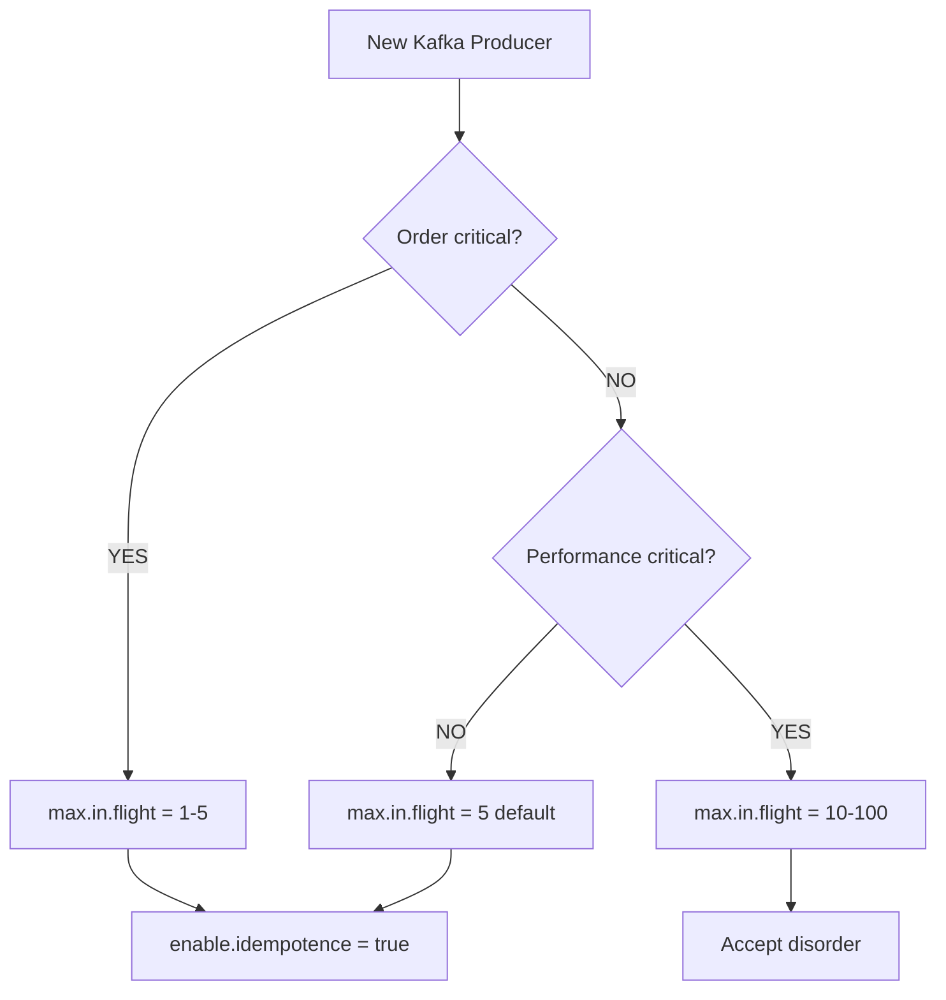

# Kafka: When max.in.flight Breaks Your Message Order

## 🎯 TL;DR

> **If `max.in.flight.requests.per.connection > 5`, your Kafka message order can be broken during retries.** Most Fortune 500 companies use `max.in.flight = 5` with `enable.idempotence = true` to guarantee both order AND exactly-once delivery.

## 📖 Introduction

Think Kafka always guarantees message order within a partition? Think again! A single misconfigured parameter can turn your ordered stream into complete chaos. Today, we'll demonstrate this behavior with minimal code and see how tech giants handle this issue.

## 🔍 The Problem: max.in.flight.requests.per.connection

### What is it?

This parameter controls the maximum number of unacknowledged requests a producer can send on a single connection. Basically, how many "in-flight batches" can exist simultaneously.

```properties
# Producer configuration
max.in.flight.requests.per.connection = 5  # Default value
```

### Why is it critical?

Imagine this scenario:

1. Your producer sends 10 batches quickly (max.in.flight = 10)
2. Batch #3 fails temporarily (network, overload...)
3. Batches #4 to #10 are written successfully
4. Batch #3 is retried and written... after the others!
5. **💥 Your messages are out of order**

## 🧪 Code Demonstration

### Docker Setup

```yaml
version: "3.8"

services:
  kafka:
    image: confluentinc/cp-kafka:7.5.0
    container_name: kafka-broker
    ports:
      - "9092:9092"
    environment:
      # KRaft configuration (without Zookeeper)
      KAFKA_NODE_ID: 1
      KAFKA_PROCESS_ROLES: "broker,controller"
      # ... other configs
```

### The Python Test

```python
def test_order_preservation(max_in_flight):
    """Test order with given max.in.flight value"""

    # Producer configuration
    producer_config = {
        'bootstrap.servers': 'localhost:9092',
        'max.in.flight.requests.per.connection': max_in_flight,
        'enable.idempotence': False,  # To allow > 5
        'retries': 10,
        'acks': 'all'
    }

    producer = Producer(producer_config)

    # Send 100 messages with same key (same partition)
    for i in range(100):
        producer.produce(
            'test-order',
            key=b'key1',
            value=f'msg-{i:03d}'.encode()
        )

    producer.flush()

    # Verify order on reception
    # ...
```

### Test Results

```bash
🧪 TEST: max.in.flight = 5 (safe limit)
========================================
📤 Sending 100 messages...
✅ msg-000 → partition[0] offset[0]
✅ msg-001 → partition[0] offset[1]
...
📊 RESULTS:
   ✅ ORDER IS PRESERVED

🧪 TEST: max.in.flight = 10 (risk of disorder)
========================================
📤 Sending 100 messages...
✅ msg-000 → partition[0] offset[0]
✅ msg-001 → partition[0] offset[1]
...
⚠️  ORDER BROKEN!
   Position 23: received 'msg-045' instead of 'msg-023'
📊 RESULTS:
   ❌ ORDER IS NOT PRESERVED
```

## 📊 Production Configurations (Fortune 500)

### 1. Financial Services 🏦

| Company       | Use Case     | max.in.flight | Idempotence |
| ------------- | ------------ | ------------- | ----------- |
| JP Morgan     | Transactions | 1             | true        |
| Goldman Sachs | Market Data  | 5             | true        |
| Visa          | Payments     | 1-3           | true        |

**Principle:** Zero tolerance for disorder in financial transactions.

### 2. E-Commerce 🛒

| Company | Use Case     | max.in.flight | Idempotence |
| ------- | ------------ | ------------- | ----------- |
| Amazon  | Orders       | 5             | true        |
| Walmart | Inventory    | 5             | true        |
| Alibaba | Logs/Metrics | 10-20         | false       |

**Principle:** Balance between performance and order based on criticality.

### 3. Tech & Streaming 📺

| Company | Use Case    | max.in.flight | Idempotence |
| ------- | ----------- | ------------- | ----------- |
| Netflix | User Events | 5-10          | true        |
| Spotify | Plays       | 5             | true        |
| YouTube | Analytics   | 50-100        | false       |

**Principle:** High performance for analytics, strict order for billing.

### 4. Social Networks 💬

| Company  | Use Case | max.in.flight | Idempotence |
| -------- | -------- | ------------- | ----------- |
| LinkedIn | Posts    | 5             | true        |
| Twitter  | Timeline | 5             | true        |
| Meta     | Metrics  | 20-50         | false       |

## 🎯 Best Practices

### Recommended Configuration

```properties
# SAFE default configuration
max.in.flight.requests.per.connection = 5
enable.idempotence = true
acks = all
retries = Integer.MAX_VALUE
max.block.ms = 60000
```

### Decision Tree



## 🚀 Run the Test Yourself

```bash
# 1. Clone the repo
git clone https://github.com/yourusername/kafka-order-test
cd kafka-order-test

# 2. Run automatic test
chmod +x run_test.sh
./run_test.sh

# Or manually
docker-compose up -d
pip install confluent-kafka==2.3.0
python3 kafka_order_test.py
docker-compose down -v
```

## 💡 Conclusions

1. **Order guarantee is not absolute** - It depends on your configuration
2. **max.in.flight ≤ 5** is the safe value to preserve order
3. **Idempotence enabled** = best of both worlds (order + exactly-once)
4. **In production**, prioritize reliability over raw throughput

## 📚 References

- [Kafka Documentation - Message Ordering](https://kafka.apache.org/documentation/#semantics)
- [Confluent - Exactly Once Semantics](https://www.confluent.io/blog/exactly-once-semantics-are-possible-heres-how-apache-kafka-does-it/)
- [Test source code](https://github.com/yourusername/kafka-order-test)

## 🏷️ Tags

`#kafka` `#distributed-systems` `#streaming` `#message-ordering` `#production-tips`

---

_Found this article useful? Share it and follow me for more content on distributed systems!_
